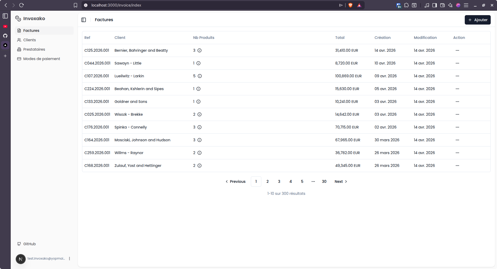

# Invoxako

Invoice management application.



## Features

- Create and manage invoices with PDF export
- Manage clients, providers, and payment modes

## Getting Started

### Prerequisites

- Node.js 20+
- pnpm
- Docker (for local PostgreSQL)

### Setup

1. Clone the repository and install dependencies:

   ```bash
   pnpm install
   ```

2. Start the local database:

   ```bash
   docker compose up -d
   ```

3. Copy the example environment file and fill in the values:

   ```bash
   cp .env-example .env
   ```

4. Apply database migrations:

   ```bash
   npx prisma migrate dev
   ```

5. Start the development server:

   ```bash
   pnpm dev
   ```

The app runs at [http://localhost:3000](http://localhost:3000).

## Running Tests

```bash
pnpm test
```

Tests use a separate `invoxako_test` database (see `.env.test`). The test command resets the database on each run.

## Deployment

The app ships as a Docker image (`herytz/invoxako`). Use `docker-compose.prod.yml` for production:

```bash
docker compose -f docker-compose.prod.yml up -d
```

Releases are automated via the GitHub Actions `Release` workflow (manual trigger).
